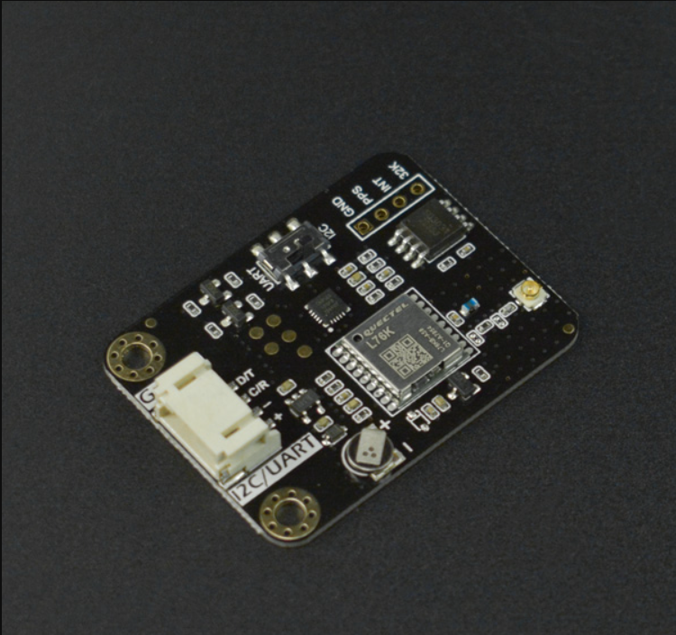

# DFRobot_GNSSAndRTC
- [English Version](./README.md)

该产品是一款集成了GNSS和RTC芯片的模块。可接收北斗、GPS等多种卫星信号，获取准确的时间信息，并为RTC校时，以确保时间的高精度和稳定性。它为用户提供了一种简单、便捷的方式来校准和维护设备的时间，适用于各种需要精确时间同步的应用场景。
在许多应用领域，时间同步是非常重要的。例如大量的物联网设备之间、自动化系统之间以及做科学研究时，都需要准确且稳定的时间作为基础。

 

## 产品链接(https://www.dfrobot.com.cn/)

    SKU: DFR1103

## 目录

* [概述](#概述)
* [库安装](#库安装)
* [方法](#方法)
* [兼容性](#兼容性y)
* [历史](#历史)
* [创作者](#创作者)

## 概述

  * 获取实时，初始时间需要用户设定，我们可以获取编译时间，自己设定，最小单位:s 
  * 设置闹钟，用户可以设置闹钟，可以在中断引脚处得到下降沿脉冲触发闹钟
  * 测量芯片温度，误差:±0.5℃


## 库安装
这里提供两种使用本库的方法：<br>
1.打开Arduino IDE,在状态栏中的Tools--->Manager Libraries 搜索"DFRobot_GNSSAndRTC"并安装本库.<br>
2.首先下载库文件,将其粘贴到\Arduino\libraries目录中,然后打开examples文件夹并在该文件夹中运行演示.<br>

## 方法

```C++

  /**
   * @fn begin
   * @brief 初始化传感器
   * @return 返回初始化状态
   */
  uint8_t begin(void);

  /**
   * @fn calibRTC(void)
   * @brief 立即用GNSS模块获得的时间校准RTC模块的时间
   * @note 这是单次校准;
   * @n 如果GNSS模块信号较弱，时间校准可能会遇到问题。
   * @return None
   */
  void calibRTC(void);

  /**
   * @fn calibRTC(uint8_t hour)
   * @brief 按照设定的时间间隔自动进行校时
   * @param hour 自动校准时间间隔。范围:0~255，单位:小时。
   * @note 当设置为零时，自动时间校准被禁用。
   * @n 启用它的同时将立即触发一次校准。
   * @n 如果GNSS模块信号较弱，时间校准可能会遇到问题。
   * @return None
   */
  void calibRTC(uint8_t hour);

  /**
   * @fn calibStatus
   * @brief 当前时钟校准状态
   * @param mode 默认是true, 访问校准状态; 
   * @n  当连续校准一分钟未成功后，可传入false，手动终止此次校准
   * @return Uint8_t类型，表示当前时钟校准状态
   * @retval 0 未校准
   * @retval 1 校准完成
   * @retval 2 正在校准
   * @note 注: 为避免影响后续的校准状态，
   * @n    “校准完成状态(1)”在第一次读取成功后自动归零
   */
  uint8_t calibStatus(bool mode = true);

/******************************************************************
 *                  RTC(SD3031) 模块 API
 ******************************************************************/

  /**
   * @fn getRTCTime
   * @brief 获取时钟模块中的年
   * @return 返回获取的年份
   */
  sTimeData_t getRTCTime(void);

  /**
   * @brief 设置时钟是24小时制还是12小时制
   * @param mode 时钟计算方式
   */
  void setHourSystem(eHours_t mode){ _mode = mode; };

  /**
   * @fn setTime
   * @brief 设置时钟时间
   * @param year 2000~2099
   * @param month 1~12
   * @param day 1~31
   * @param week 0~6
   * @param hour 0~23
   * @param minute 0~59
   * @param second 0~59
   * @return None
   */
  void setTime(uint16_t year, uint8_t month, uint8_t day,eWeek_t week,uint8_t hour, uint8_t minute, uint8_t second);

  /**
   * @fn setAlarm
   * @brief 设置触发告警数据
   * @param year 2000~2099
   * @param month 1~12
   * @param day 1~31
   * @return None
   */
  void setAlarm(uint16_t year, uint8_t month, uint8_t day);
  /**
   * @fn setAlarm
   * @brief 设置触发告警数据
   * @param week eWeek_t
   * @n ---------------------------------------------------------------------------------------------------------
   * @n |    bit7    |    bit6    |    bit5    |    bit4    |    bit3    |    bit2    |    bit1    |    bit0    |
   * @n ---------------------------------------------------------------------------------------------------------
   * @n |            |  Saturday  |  Friday    |  Thursday  | Wednesday  |  Tuesday   |  Monday    |  Sunday    |
   * @n ---------------------------------------------------------------------------------------------------------
   * @param hour 0~23
   * @param minute 0~59
   * @param second 0~59
   */
  void setAlarm(eWeek_t week, uint8_t hour, uint8_t minute, uint8_t second);

  /**
   * @brief 获取时钟内部温度
   * @return 返回获取得温度，单位：℃
   */
  int8_t getTemperatureC(void);

  /**
   * @brief 获取板载电池电压
   * @return float 返回获取得电压
   */
  float getVoltage(void);

  /**
   * @brief 清除报警标志位
   */
  void clearAlarm(void);
  /**
   * @fn getAMorPM
   * @brief 输出上午或下午的时间
   * @return 上午或下午的时间，24小时模式返回空字符串
   */
  String getAMorPM();

  /**
   * @fn enable32k
   * @brief 开启32k频率输出
   * @return 无
   */
  void enable32k();

  /**
   * @fn disable32k
   * @brief 关闭32k输出
   * @return 无
   */
  void disable32k();
  /**
   * @fn writeSRAM
   * @brief 写 SRAM
   * @param addr 0x14~0xFF
   * @param data 写数据
   * @return true 意味着写SRAM是成功的, false 意味着写SRAM是失败的
   */
  uint8_t writeSRAM(uint8_t addr, uint8_t data);

  /**
   * @fn readSRAM
   * @brief 读 SRAM
   * @param addr 0x14~0xFF
   * @return 存储在SRAM中的数据
   */
  uint8_t readSRAM(uint8_t addr);

  /**
   * @fn clearSRAM
   * @brief 清除SRAM
   * @param addr 0x14~0xFF
   * @return true 意味着清除SRAM是成功的, false 意味着清除SRAM是失败的
   */
  uint8_t clearSRAM(uint8_t addr);
  
  /**
   * @fn countDown
   * @brief 倒计时
   * @param second  倒计时时间 0~0xffffff
   */
  void countDown(uint32_t second);

/******************************************************************
 *                  GNSS(L76K) 模块 API
 ******************************************************************/
/**
 * @fn getUTC
 * @brief 获取utc 标准时间
 * @return sTim_t 类型，表示返回的时分秒
 * @retval sTim_t.hour 时
 * @retval sTim_t.minute 分
 * @retval sTim_t.second 秒
 */
  sTim_t getUTC(void);

/**
 * @fn getDate
 * @brief 获取年月日等日期
 * @return sTim_t 类型，表示返回的年月日
 * @retval sTim_t.year 年
 * @retval sTim_t.month 月
 * @retval sTim_t.day 日
 */
  sTim_t getDate(void);

/**
 * @fn getLat
 * @brief 获取纬度
 * @return sLonLat_t 类型，表示返回的经纬度
 * @retval sLonLat_t.latDD   纬度 度（0-90）
 * @retval sLonLat_t.latMM   纬度 分后0-2位小数
 * @retval sLonLat_t.latMMMMM 纬度 分后2-7位小数
 * @retval sLonLat_t.latitude 包含7位小数的纬度值
 * @retval sLonLat_t.latDirection 纬度的方向
 */
  sLonLat_t getLat(void);

/**
 * @fn getLon
 * @brief 获取经度
 * @return sLonLat_t 类型，表示返回的经度
 * @retval sLonLat_t.lonDDD  经度 度（0-90）
 * @retval sLonLat_t.lonMM   经度 分后0-2位小数
 * @retval sLonLat_t.lonMMMMM 经度 分后2-7位小数
 * @retval sLonLat_t.lonitude 包含7位小数的经度值
 * @retval sLonLat_t.lonDirection 经度的方向
 */
  sLonLat_t getLon(void);

/**
 * @fn getNumSatUsed
 * @brief 获取使用的卫星数
 * @return uint8_t 类型，表示使用的卫星数
 */
  uint8_t getNumSatUsed(void);

/**
 * @fn getAlt
 * @brief 获取大地的高度
 * @return double 类型，表示大地的高度
 */
  double getAlt(void);

/**
 * @fn getSog
 * @brief 获取对地速度
 * @return speed 浮点型数据 （单位 节）
 */
  double getSog(void);

/**
 * @fn getCog
 * @brief 获取对地真航向
 * @return 浮点型数据 （单位 度）
 */
  double getCog(void);

/**
 * @fn setGnss
 * @brief 设置星系
 * @param mode
 * @n   eGPS              使用 gps
 * @n   eBeiDou           使用 beidou
 * @n   eGPS_BeiDou       使用 gps + beidou
 * @n   eGLONASS          使用 glonass
 * @n   eGPS_GLONASS      使用 gps + glonass
 * @n   eBeiDou_GLONASS   使用 beidou +glonass
 * @n   eGPS_BeiDou_GLONASS 使用 gps + beidou + glonass
 * @return NULL
 */
  void setGnss(eGnssMode_t mode);

/**
 * @fn getGnssMode
 * @brief 获取使用的星系模式
 * @return mode
 * @retval 1 使用 gps
 * @retval 2 使用 beidou
 * @retval 3 使用 gps + beidou
 * @retval 4 使用 glonass
 * @retval 5 使用 gps + glonass
 * @retval 6 使用 beidou +glonass
 * @retval 7 使用 gps + beidou + glonass
 */
  uint8_t getGnssMode(void);

/**
 * @fn getAllGnss
 * @brief 获取gnss的数据,回调接收
 * @return null
 */
  void getAllGnss(void);

/**
 * @fn enablePower
 * @brief 使能gnss的电源
 * @return null
 */
void enablePower(void);

/**
 * @fn disablePower
 * @brief 失能gnss的电源
 * @return null
 */
void disablePower(void);

/**
 * @fn setCallback
 * @brief 设置回调函数类型
 * @param  * call 函数名
 * @return null
 */
  void setCallback(void (*call)(char *, uint8_t));
```

## 兼容性

MCU                | Work Well    |   Work Wrong    | Untested    | Remarks
------------------ | :----------: | :-------------: | :---------: | :----:
Arduino Uno        |      √       |                 |             |
Arduino MEGA2560   |      √       |                 |             |
Arduino Leonardo   |      √       |                 |             |
FireBeetle-ESP8266 |      √       |                 |             |
FireBeetle-ESP32   |      √       |                 |             |
FireBeetle-M0      |      √       |                 |             |
Micro:bit          |      √       | nonsupport uart |             |


## 历史

- 2023/08/31 - V1.0.0 版本

## 创作者

Written by qsjhyy(yihuan.huang@dfrobot.com), 2023. (Welcome to our website)