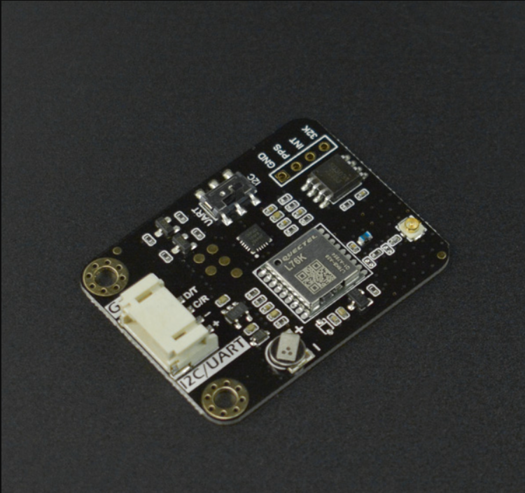

# DFRobot_GNSSAndRTC

- [English Version](./README.md)

该产品是一款集成了GNSS和RTC芯片的模块。可接收北斗、GPS等多种卫星信号，获取准确的时间信息，并为RTC校时，以确保时间的高精度和稳定性。它为用户提供了一种简单、便捷的方式来校准和维护设备的时间，适用于各种需要精确时间同步的应用场景。
在许多应用领域，时间同步是非常重要的。例如大量的物联网设备之间、自动化系统之间以及做科学研究时，都需要准确且稳定的时间作为基础。

 

## 产品链接(https://www.dfrobot.com.cn/)

    SKU: DFR1103

## 目录

* [概述](#概述)
* [库安装](#库安装)
* [方法](#方法)
* [兼容性](#兼容性)
* [历史](#历史)
* [创作者](#创作者)

## 概述

  * 获取实时，初始时间需要用户设定，我们可以获取编译时间，自己设定，最小单位:s 
  * 设置闹钟，用户可以设置闹钟，可以在中断引脚处得到下降沿脉冲触发闹钟
  * 测量芯片温度，误差:±0.5℃

## 库安装

要使用这个库，首先将库下载到Raspberry Pi，然后打开用例文件夹。要执行一个用例demox.py，请在命令行中输入python demox.py。例如，要执行control32k.py用例，你需要输入：

```
python control32k.py
```


## 方法

```python

'''!
  @brief 初始化传感器
  @return 返回初始化状态
'''
  def begin(self):

'''!
  @brief 立即用GNSS模块获得的时间校准RTC模块的时间
  @note 这是单次校准;
  @n 如果GNSS模块信号较弱，时间校准可能会遇到问题。
'''
  def calib_rtc(self):

'''!
  @brief 按照设定的时间间隔自动进行校时
  @param hour 自动校准时间间隔。范围:0~255，单位:小时。
  @note 当设置为零时，自动时间校准被禁用。
  @n 启用它的同时将立即触发一次校准。 
  @n 如果GNSS模块信号较弱，时间校准可能会遇到问题。
'''
  def calib_rtc_hour(self, hour):

'''!
  @brief 当前时钟校准状态
  @param mode 默认是True, 访问校准状态; 
  @n  当连续校准一分钟未成功后，可传入False，手动终止此次校准
  @return uint8_t类型，表示当前时钟校准状态
  @retval 0 未校准
  @retval 1 校准完成
  @retval 2 正在校准
  @note 注: 为避免影响后续的校准状态，
  @n    “校准完成状态(1)”在第一次读取成功后自动归零
'''
  def calib_status(self, mode=True):

'''!
/******************************************************************
 *                  RTC(SD3031) 模块 API
 ******************************************************************/
'''
'''!
  @brief 获取时钟模块中的年
  @return 返回获取的年份
'''
  def get_rtc_time(self):

'''!
  @brief 设置时钟是24小时制还是12小时制
  @param mode 时钟计算方式
  @n	E24HOURS
  @n	E12HOURS
'''
  def set_hour_system(self, mode):

'''!
  @brief 设置时钟时间
  @param year 2000~2099
  @param month 1~12
  @param day 1~31
  @param hour 0~23
  @param minute 0~59
  @param second 0~59
'''
  def set_time(self, year, month, day, hour, minute, second):

'''!
  @brief 设置触发告警数据
  @param year 2000~2099
  @param month 1~12
  @param day 1~31
'''
  def set_alarm(self, year, month, day):

'''!
  @brief 设置触发告警数据
  @param week
  @n ---------------------------------------------------------------------------------------------------------
  @n | EWORKDAY | EEVERYDAY | ESATURDAY | EFRIDAY | ETHURSDAY | EWEDNESDAY | ETUESDAY | EMONDAY | ESUNDAY |
  @n ---------------------------------------------------------------------------------------------------------
  @param hour 0~23
  @param minute 0~59
  @param second 0~59
'''
  def set_alarm(self, week, hour, minute, second):

'''!
  @brief 获取时钟内部温度
  @return 返回获取得温度，单位：℃
'''
  def get_temperature_c(self):

'''!
  @brief 获取板载电池电压
  @return float 返回获取得电压
'''
  def get_voltage(self):

'''!
  @brief 清除报警标志位
'''
  def clear_alarm(self):
  
'''!
  @brief 输出上午或下午的时间
  @return 上午或下午的时间，24小时模式返回空字符串
'''
  def get_am_or_pm(self):

'''!
  @brief 开启32k频率输出
'''
  def enable_32k(self):

'''!
  @brief 关闭32k输出
'''
  def disable_32k(self):
    
'''!
  @brief 写 SRAM
  @param addr 0x2c~0x71
  @param data 0x00~0xff 写数据
'''
  def write_sram(self, addr, data):

'''!
  @brief 读 SRAM
  @param addr 0x2c~0x71
  @return 存储在SRAM中的数据
'''
  def read_sram(self, addr):

'''!
  @brief 清除SRAM
  @param addr 0x2c~0x71
'''
  def clear_sram(self, addr):
  
'''!
  @brief 倒计时
  @param second  倒计时时间 0~0xffffff
'''
  def count_down(self, second):

'''!
/******************************************************************
 *                  GNSS(L76K) 模块 API
 ******************************************************************/
'''

'''!
  @brief 获取utc 标准时间
  @return STim_t 类型，表示返回的时分秒
  @retval STim_t.hour 时
  @retval STim_t.minute 分
  @retval STim_t.second 秒
'''
  def get_utc(self):

'''!
  @brief 获取年月日等日期
  @return STim_t 类型，表示返回的年月日
  @retval STim_t.year 年
  @retval STim_t.month 月
  @retval STim_t.day 日
'''
  def get_date(self):

'''!
  @brief 获取纬度
  @return SLonLat_t 类型，表示返回的经纬度
  @retval SLonLat_t.latDD   纬度 度（0-90）
  @retval SLonLat_t.latMM   纬度 分后0-2位小数
  @retval SLonLat_t.latMMMMM 纬度 分后2-7位小数
  @retval SLonLat_t.latitude 包含7位小数的纬度值
  @retval SLonLat_t.latDirection 纬度的方向
'''
  def get_lat(self):

'''!
  @brief 获取经度
  @return SLonLat_t 类型，表示返回的经度
  @retval SLonLat_t.lonDDD  经度 度（0-90）
  @retval SLonLat_t.lonMM   经度 分后0-2位小数
  @retval SLonLat_t.lonMMMMM 经度 分后2-7位小数
  @retval SLonLat_t.lonitude 包含7位小数的经度值
  @retval SLonLat_t.lonDirection 经度的方向
'''
  def get_lon(self):

'''!
  @brief 获取使用的卫星数
  @return uint8_t 类型，表示使用的卫星数
'''
  def get_num_sat_used(self):

'''!
  @brief 获取大地的高度
  @return double 类型，表示大地的高度
'''
  def get_alt(self):

'''!
  @brief 获取对地速度
  @return speed 浮点型数据 （单位 节）
'''
  def get_sog(self):

'''!
  @brief 获取对地真航向
  @return 浮点型数据 （单位 度）
'''
  def get_cog(self):

'''!
  @brief 设置星系
  @param mode
  @n   EGPS              使用 gps
  @n   EBEIDOU           使用 beidou
  @n   EGPS_BEIDOU       使用 gps + beidou
  @n   EGLONASS          使用 glonass
  @n   EGPS_GLONASS      使用 gps + glonass
  @n   EBEIDOU_GLONASS   使用 beidou +glonass
  @n   EGPS_BEIDOU_GLONASS 使用 gps + beidou + glonass
'''
  def set_gnss(self, mode):

'''!
  @brief 获取使用的星系模式
  @return mode
  @retval 1 使用 gps
  @retval 2 使用 beidou
  @retval 3 使用 gps + beidou
  @retval 4 使用 glonass
  @retval 5 使用 gps + glonass
  @retval 6 使用 beidou +glonass
  @retval 7 使用 gps + beidou + glonass
'''
  def get_gnss_mode(self):

'''!
  @brief 获取gnss的数据,回调接收
'''
  def get_all_gnss(self):

'''!
  @brief 使能gnss的电源
'''
  def enable_power(self):

'''!
  @brief 失能gnss的电源
'''
  def disable_power(self):

'''!
  @brief 设置回调函数类型
  @param  callback 函数名
'''
  def set_callback(self, callback):
```

## 兼容性

|              |      |        |        |      |
| ------------ | ---- | ------ | ------ | ---- |
| 主板         | 通过 | 未通过 | 未测试 | 备注 |
| RaspberryPi2 |      |        | √      |      |
| RaspberryPi3 |      |        | √      |      |
| RaspberryPi4 | √    |        |        |      |

- Python 版本

|         |      |        |        |      |
| ------- | ---- | ------ | ------ | ---- |
| Python  | 通过 | 未通过 | 未测试 | 备注 |
| Python2 | √    |        |        |      |
| Python3 | √    |        |        |      |

## 历史

- 2024/07/15 - V1.0.0 版本

## 创作者

Written by thdyyl(yuanlong.yu@dfrobot.com), 2024. (Welcome to our website)

